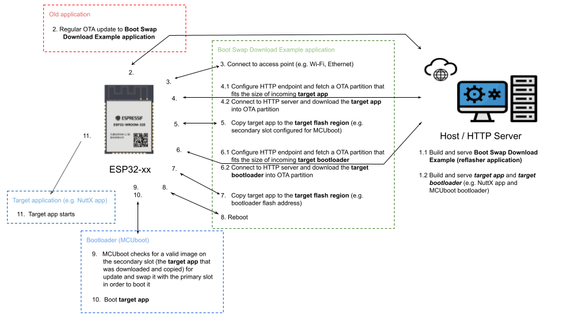

# Boot swap download binary example with MCUboot

| Supported Targets | ESP32    | ESP32-S2 | ESP32-S3 | ESP32-C3 | ESP32-C6 |
| ----------------- | -------- | -------- | -------- | -------- | -------- |

## Overview

This project exemplifies how the IDF bootloader + IDF application can be migrated to another **target bootloader/OS/app** using the `esp-self-reflasher` Download reflashing image mode.

The **target bootloader** and **target OS/app** considered in this example are the **MCUboot** bootloader and a **NuttX OS** `nsh` application.

The migration is achieved by updating (using IDF OTA system for instance) an IDF based system with this application (this project), which will download the target **reflashing images** through HTTP into a OTA partition, then copy them to the destination flash region.

Particularly, this example makes two downloads, one for the **target app** and other for the **target bootloader**, so an existing OTA partition do not need to fit the sum of both binaries sizes at once.

The **target bootloader** destination is the regular bootloader region address. However, the **target app** destination is the planned MCUboot `secondary slot` address instead of the `primary slot` address, this was done to avoid the conflict with the current running application (this project) as the last may still have systems running from flash while copying the **target app** to its destination. Therefore, this example uses the MCUboot swapping mechanism in order to complete the migration, so after the download and copy of the images, the system reboots and the newly-written MCUboot bootloader handles the slot swapping in order to place the application into the correct slot for execution. For more information about MCUboot, check the [MCUboot documentation](https://docs.mcuboot.com/).

### HTTP download limitation

Currently this example works with plain HTTP requests for downloading. HTTPS work is on progress.

### Workflow diagram



## How to use the example

### Configure the project

Open the project configuration menu (`idf.py menuconfig`).

In the `Example Configuration` menu:

* Configure the `Bootloader reflash configuration`:
    * Set the URL endpoint of the **target bootloader**. The format should be `http://<host-ip-address>:<host-port>/<bootloader-image-filename>`, e.g. `http://192.168.100.101:8070/mcuboot_esp32.bin`;
    * Set the destination address for the **target bootloader**;
    * Set the bootloader region size;
* Configure the `Application reflash configuration`:
    * Set the URL endpoint of the **target app**. The format should be `http://<host-ip-address>:<host-port>/<application-image-filename>`, e.g. `http://192.168.100.101:8070/app_upd.bin`;
    * Set the destination address for the **target application**;
    * Set the application slot size;
* Optionally, set a target data partition name where the download will be placed. Note that the partition will be fetched by name, so it must exists, also important to notice that the partition will be **erased**;

### Build and flash

Considering the goal of the example, the project may be built using:

```CMake
idf.py build
```

And sent through a firmware update method, for instance using the IDF OTA system.

However, to simply run locally, type the following command:

```CMake
idf.py -p PORT flash monitor
```

(To exit the serial monitor, type ``Ctrl-]``.)

See the [Getting Started Guide](https://docs.espressif.com/projects/esp-idf/en/stable/esp32/index.html) for full steps to configure and use ESP-IDF to build projects.

### Running Local HTTP Server

After the project build, a HTTP server can be created locally for testing purposes. For instance:

* Python HTTP server:
    - Execute `python -m http.server 8070` in the directory with the **target reflashing images**;
    - Use http://<host-ip>:8070/<image-name> as the download URL endpoint;
    - E.g.:
    ``` bash
    $ cd ~/esp-idf/components/esp-self-reflasher/examples/boot_swap_download_example/example_bin_dir
    $ sudo python -m http.server -b 192.168.100.101 8070
    Serving HTTP on 192.168.100.101 port 8070 (http://192.168.100.101:8070/) ...
    192.168.100.100 - - [03/Dec/2024 16:06:58] "GET /app_upd.bin HTTP/1.1" 200 -
    192.168.100.100 - - [03/Dec/2024 16:07:01] "GET /mcuboot_esp32.bin HTTP/1.1" 200 -
    ```

### Example Output

After the mentioned hypothetical update or the local flash, this application will connect to the first endpoint configured, download the **target app** image (a NuttX app) and copy it to destination address, then it will connect to the second endpoint, download the **target bootloader** image (MCUboot bootloader), copy it to the destination (bootloader region) and then reboot, completing the migration when the MCUboot bootloader finishes the slot swapping, as shown below:

```
I (27) boot: ESP-IDF v5.1.4 2nd stage bootloader
I (27) boot: compile time Dec  3 2024 17:32:41
I (27) boot: Multicore bootloader
I (30) boot: chip revision: v0.2
I (34) boot.esp32s3: Boot SPI Speed : 80MHz
I (39) boot.esp32s3: SPI Mode       : DIO
I (43) boot.esp32s3: SPI Flash Size : 8MB
I (48) boot: Enabling RNG early entropy source...
I (53) boot: Partition Table:
I (57) boot: ## Label            Usage          Type ST Offset   Length
I (64) boot:  0 nvs              WiFi data        01 02 00009000 00004000
I (72) boot:  1 otadata          OTA data         01 00 0000d000 00002000
I (79) boot:  2 phy_init         RF data          01 01 0000f000 00001000
I (87) boot:  3 factory          factory app      00 00 00010000 00100000
I (94) boot:  4 ota_0            OTA app          00 10 00110000 00100000
I (102) boot:  5 ota_1            OTA app          00 11 00210000 00100000
I (109) boot: End of partition table
I (113) boot: Defaulting to factory image
I (118) esp_image: segment 0: paddr=00010020 vaddr=3c0a0020 size=249cch (149964) map
I (153) esp_image: segment 1: paddr=000349f4 vaddr=3fc99000 size=05e04h ( 24068) load
I (159) esp_image: segment 2: paddr=0003a800 vaddr=40374000 size=05818h ( 22552) load
I (164) esp_image: segment 3: paddr=00040020 vaddr=42000020 size=99580h (628096) map
I (280) esp_image: segment 4: paddr=000d95a8 vaddr=40379818 size=0f700h ( 63232) load
I (304) boot: Loaded app from partition at offset 0x10000
I (304) boot: Disabling RNG early entropy source...
I (315) cpu_start: Multicore app
I (316) cpu_start: Pro cpu up.
I (316) cpu_start: Starting app cpu, entry point is 0x40375664
I (0) cpu_start: App cpu up.
I (334) cpu_start: Pro cpu start user code
I (334) cpu_start: cpu freq: 160000000 Hz
I (334) cpu_start: Application information:
I (337) cpu_start: Project name:     boot_swap_download
I (343) cpu_start: App version:      4ec0b2b-dirty
I (348) cpu_start: Compile time:     Dec  3 2024 18:37:02
I (354) cpu_start: ELF file SHA256:  0c2fb14b4bba272e...
I (360) cpu_start: ESP-IDF:          v5.1.4
I (365) cpu_start: Min chip rev:     v0.0
I (370) cpu_start: Max chip rev:     v0.99
I (375) cpu_start: Chip rev:         v0.2
I (379) heap_init: Initializing. RAM available for dynamic allocation:
I (387) heap_init: At 3FCA2E38 len 000468D8 (282 KiB): DRAM
I (393) heap_init: At 3FCE9710 len 00005724 (21 KiB): STACK/DRAM
I (399) heap_init: At 3FCF0000 len 00008000 (32 KiB): DRAM
I (406) heap_init: At 600FE010 len 00001FD8 (7 KiB): RTCRAM
I (413) spi_flash: detected chip: gd
I (416) spi_flash: flash io: dio
I (420) sleep: Configure to isolate all GPIO pins in sleep state
I (427) sleep: Enable automatic switching of GPIO sleep configuration
I (434) app_start: Starting scheduler on CPU0
I (439) app_start: Starting scheduler on CPU1
I (439) main_task: Started on CPU0
I (449) main_task: Calling app_main()
I (449) boot_swap_download_example: Self Reflasher example app_main start
I (509) example_connect: Start example_connect.
I (509) pp: pp rom version: e7ae62f
I (509) net80211: net80211 rom version: e7ae62f
I (529) wifi:wifi driver task: 3fcacb4c, prio:23, stack:6656, core=0
I (529) wifi:wifi firmware version: 3ce09e5
I (529) wifi:wifi certification version: v7.0
I (529) wifi:config NVS flash: enabled
I (529) wifi:config nano formating: disabled
I (539) wifi:Init data frame dynamic rx buffer num: 32
I (539) wifi:Init static rx mgmt buffer num: 5
I (539) wifi:Init management short buffer num: 32
I (549) wifi:Init dynamic tx buffer num: 32
I (549) wifi:Init static tx FG buffer num: 2
I (559) wifi:Init static rx buffer size: 1600
I (559) wifi:Init static rx buffer num: 10
I (569) wifi:Init dynamic rx buffer num: 32
I (569) wifi_init: rx ba win: 6
I (569) wifi_init: tcpip mbox: 32
I (579) wifi_init: udp mbox: 6
I (579) wifi_init: tcp mbox: 6
I (579) wifi_init: tcp tx win: 5760
I (589) wifi_init: tcp rx win: 5760
I (589) wifi_init: tcp mss: 1440
I (599) wifi_init: WiFi IRAM OP enabled
I (599) wifi_init: WiFi RX IRAM OP enabled
I (609) phy_init: phy_version 670,b7bc9b9,Apr 30 2024,10:54:13
W (609) phy_init: failed to load RF calibration data (0x1102), falling back to full calibration
I (659) wifi:mode : sta (dc:da:0c:61:94:9c)
I (659) wifi:enable tsf
I (659) example_connect: Connecting to Home...
I (669) example_connect: Waiting for IP(s)
I (3069) wifi:new:<11,0>, old:<1,0>, ap:<255,255>, sta:<11,0>, prof:1
I (3559) wifi:state: init -> auth (b0)
I (3559) wifi:state: auth -> assoc (0)
I (3569) wifi:state: assoc -> run (10)
I (3579) wifi:connected with Home, aid = 1, channel 11, BW20, bssid = 10:be:f5:20:ca:b4
I (3579) wifi:security: WPA2-PSK, phy: bg, rssi: -32
I (3579) wifi:pm start, type: 1

I (3579) wifi:dp: 1, bi: 102400, li: 3, scale listen interval from 307200 us to 307200 us
I (3589) wifi:set rx beacon pti, rx_bcn_pti: 0, bcn_timeout: 25000, mt_pti: 0, mt_time: 10000
I (3599) wifi:AP's beacon interval = 102400 us, DTIM period = 1
I (5509) example_connect: Got IPv6 event: Interface "example_netif_sta" address: fe80:0000:0000:0000:deda:0cff:fe61:949c, type: ESP_IP6_ADDR_IS_LINK_LOCAL
I (6609) esp_netif_handlers: example_netif_sta ip: 192.168.100.100, mask: 255.255.255.0, gw: 192.168.100.1
I (6609) example_connect: Got IPv4 event: Interface "example_netif_sta" address: 192.168.100.100
I (6619) example_common: Connected to example_netif_sta
I (6619) example_common: - IPv4 address: 192.168.100.100,
I (6629) example_common: - IPv6 address: fe80:0000:0000:0000:deda:0cff:fe61:949c, type: ESP_IP6_ADDR_IS_LINK_LOCAL
I (6639) wifi:Set ps type: 0, coexist: 0

I (6639) boot_swap_download_example: Starting Self Reflasher example task
I (6649) self_reflasher: src_start 0x00210000 src_end 0x00310000 dest_start 0x00110000 dest_end 0x00210000
I (6779) main_task: Returned from app_main()
I (7349) self_reflasher: Partition erased successfully
I (13299) self_reflasher: Connection closed
I (13299) self_reflasher: Total downloaded binary length: 1048576 (0x100000)
I (13299) self_reflasher: File downloaded successfully
I (13309) self_reflasher: Starting copy 0x00100000 bytes from address 0x00210000 to address 0x00110000
I (14049) self_reflasher: Flash destination region erased successfully
I (16459) self_reflasher: Data copied from partition address 0x00210000 offset 0x00000000 to region: 0x00110000
I (16459) self_reflasher: Updating configuration for next download
I (16469) self_reflasher: Current selected partition for download placement will be erased
I (17309) self_reflasher: Partition erased successfully
I (17539) self_reflasher: Connection closed
I (17539) self_reflasher: Total downloaded binary length: 39776 (0x9b60)
I (17539) self_reflasher: File downloaded successfully
I (17549) self_reflasher: Starting copy 0x00009b60 bytes from address 0x00210000 to address 0x00000000
I (18099) self_reflasher: Flash destination region erased successfully
I (18239) self_reflasher: Data copied from partition address 0x00210000 offset 0x00000000 to region: 0x00000000
I (18239) boot_swap_download_example: MCUboot+Image overwritting succeed, Rebooting...
I (19249) wifi:state: run -> init (0)
I (19249) wifi:pm stop, total sleep time: 2168390 us / 15663907 us

I (19249) wifi:new:<11,0>, old:<11,0>, ap:<255,255>, sta:<11,0>, prof:1
I (19289) wifi:flush txq
I (19289) wifi:stop sw txq
I (19289) wifi:lmac stop hw txq
I (19289) wifi:Deinit lldesc rx mblock:10
ESP-ROM:esp32s3-20210327
Build:Mar 27 2021
rst:0x3 (RTC_SW_SYS_RST),boot:0x8 (SPI_FAST_FLASH_BOOT)
Saved PC:0x40375a2c
SPIWP:0xee
mode:DIO, clock div:2
load:0x3fcd35a8,len:0x1780
load:0x403b0000,len:0x3d14
load:0x403ba000,len:0x4670
entry 0x403be5ec
[esp32s3] [INF] *** Booting MCUboot build v2.1.0-133-g33de65ce ***
[esp32s3] [INF] [boot] chip revision: v0.2
[esp32s3] [INF] [boot.esp32s3] Boot SPI Speed : 40MHz
[esp32s3] [INF] [boot.esp32s3] SPI Mode       : DIO
[esp32s3] [INF] [boot.esp32s3] SPI Flash Size : 4MB
[esp32s3] [INF] [boot] Enabling RNG early entropy source...
[esp32s3] [INF] Primary image: magic=good, swap_type=0x3, copy_done=0x1, image_ok=0x1
[esp32s3] [INF] Scratch: magic=unset, swap_type=0x1, copy_done=0x3, image_ok=0x3
[esp32s3] [INF] Boot source: none
[esp32s3] [INF] Image index: 0, Swap type: perm
[esp32s3] [INF] Starting swap using scratch algorithm.
[esp32s3] [INF] Disabling RNG early entropy source...
[esp32s3] [INF] br_image_off = 0x10000
[esp32s3] [INF] ih_hdr_size = 0x20
[esp32s3] [INF] Loading image 0 - slot 0 from flash, area id: 1
[esp32s3] [INF] DRAM segment: start=0x199d8, size=0xaac, vaddr=0x3fc8a150
[esp32s3] [INF] IRAM segment: start=0x16c04, size=0x2dd4, vaddr=0x40374000
[esp32s3] [INF] start=0x40374bd8
IROM segment aligned lma 0x00020000 vma 0x42010000 len 0x015873 (88179)
DROM segment aligned lma 0x00010000 vma 0x3c000000 len 0x006bc4 (27588)
NuttShell (NSH) NuttX-10.4.0
nsh>
```
